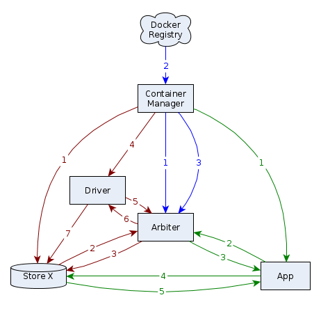
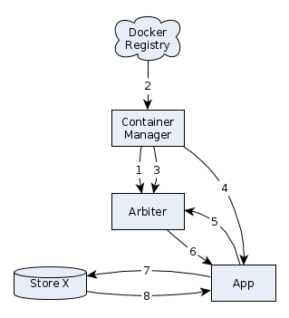

# Databox Arbiter

The Databox Docker container that manages the flow of data. This code is not meant to be run on its own except for debug purposes. The live version is automatically pulled from https://amar.io:5000 as "databox-arbiter" and launched by the [container manager](https://github.com/me-box/databox-container-manager.git).

For debug purposes:

## Installation
	git clone https://github.com/me-box/databox-arbiter.git
	cd databox-arbiter
	npm install --production

## Usage
	npm start

Default port is 8080, but can be overridden using the PORT environment variable, i.e.:

	PORT=8081 npm start

Then interface with http://localhost:8080/.

## API Endpoints

Coming soon.

## Further information

### Arbiter Flow

#### Combined Flow

##### Part A (blue)

1. Once the container manager (CM -- not a container itself) is launched, it launches the arbiter container after pulling any updates from the registry. On launching the arbiter, it also supplies it with a public key as an environment variable such that the arbiter can confirm if privileged commands are indeed coming from the CM.
2. A container (driver or app) is pulled from the registry along with its manifest.
3. The CM generates unique tokens for every container it will launch, and informs the arbiter of these tokens and the extent of corresponding containers' permissions.

##### Part B (red)

1. Before launching a driver, the CM launches one or more store containers to be written to by this driver -- as specified in the driver's manifest -- and passes the previously generated tokens to these stores.
2. The stores register themselves with the arbiter using their tokens.
3. The arbiter generates a secret key for every store, associates it with store tokens, and responds to the request with it. Using this key, a store can now verify macaroons minted by the arbiter and given to apps.
4. The CM launches a driver container and provides it with a token.
5. The driver uses this token to request write access to its associated stores. This process may need to be repeated periodically as macaroons expire.
6. On checking the token against the record created in part A step 3, the arbiter generates macaroons that allow writing to corresponding stores.
7. The driver can now use these macaroons to directly write to its stores (which are accessed by hostname defined by a driver name and names specified in a driver manifest).

##### Part C (green)

1. The CM launches an app container and provides it with a token.
2. The app uses this token to request read access to one or more stores (see Part B). This process may need to be repeated periodically as macaroons expire.
3. On checking the token against the record created in part A step 3, the arbiter generates macaroons that allow reading from corresponding stores. Granularity restrictions or store-specific permissions are encoded as caveats into the macaroons.
4. The app can now use these macaroons to directly query the stores (which are accessed by hostname defined by a driver name and names specified in a driver manifest).
5. A store, on verifying a macaroon using the secret key supplied to it by the arbiter (see part B step 3) can respond to the app with the data requested.

#### Driver-Centric Flow

1. Once the container manager (CM -- not a container itself) is launched, it launches the arbiter container after pulling any updates from the registry. On launching the arbiter, it also supplies it with a public key as an environment variable such that the arbiter can confirm if privileged commands are indeed coming from the CM.
2. A driver container is pulled from the registry along with its manifest.
3. The CM generates unique IDs for every container it will launch, and informs the arbiter of these IDs and the extent of corresponding containers' permissions.
4. The CM launches one or more store containers to be written to by this driver -- as specified in the driver's manifest -- and passes the previously generated tokens to these stores.
5. The stores register themselves with the arbiter using their individual tokens.
6. The arbiter generates a secret key for every store, associates it with store tokens, and responds to the request with it. Using this key, a store can now verify macaroons minted by the arbiter and given to apps.
7. The CM launches a driver container and provides it with a token.
8. The driver uses this token to request write access to its associated stores. This process may need to be repeated periodically as macaroons expire.
9. On checking the token against the record created in (3), the arbiter generates macaroons that allow writing to corresponding stores.
10. The driver can now use these macaroons to directly write to its stores (which are accessed by hostname defined by a driver name and names specified in a driver manifest).

#### App-Centric Flow

1. Once the container manager (CM -- not a container itself) is launched, it launches the arbiter container after pulling any updates from the registry. On launching the arbiter, it also supplies it with a public key as an environment variable such that the arbiter can confirm if privileged commands are indeed coming from the CM.
2. An app container is pulled from the registry along with its manifest.
3. The CM generates unique IDs for every container it will launch, and informs the arbiter of these IDs and the extent of corresponding containers' permissions.
4. The CM launches an app container and provides it with a token.
5. The app uses this token to request read access to one or more stores (see DCF). This process may need to be repeated periodically as macaroons expire.
6. On checking the token against the record created in (3), the arbiter generates macaroons that allow reading from corresponding stores. Granularity restrictions or store-specific permissions are encoded as caveats into the macaroons.
7. The app can now use these macaroons to directly query the stores (which are accessed by hostname defined by a driver name and names specified in a driver manifest).
8. A store, on verifying a macaroon using the secret key supplied to it by the arbiter (see (6) in DCF) can respond to the app with the data requested.
